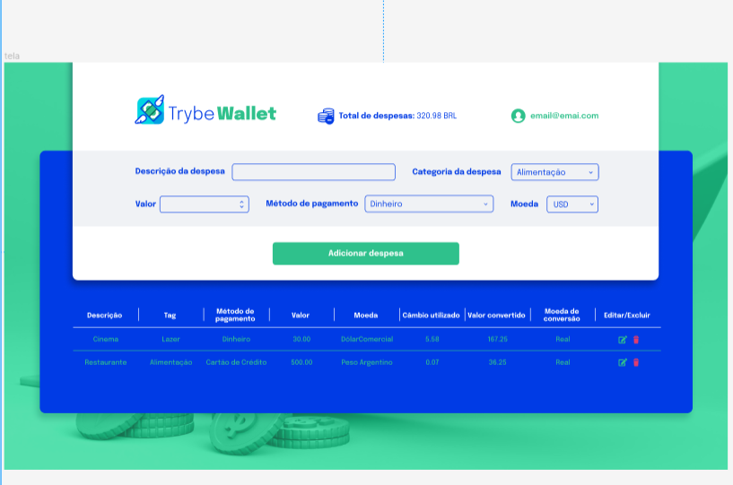

# TrybeWallet



> Uma aplicação de controle de gastos com conversor de moedas.

A TrybeWallet é uma carteira de controle de gastos que permite ao usuário adicionar, remover e editar despesas, visualizar uma tabela com seus gastos e ver o total de gastos convertidos para uma moeda de escolha. Este projeto tem como objetivo desenvolver habilidades em Redux e integração com APIs.

## Funcionalidades

- Adicionar, remover e editar despesas.
- Visualizar uma tabela com os gastos.
- Visualizar o total de gastos convertidos para uma moeda de escolha.

## API de Cotações

A página web irá consumir os dados da API do AwesomeAPI - API de Cotações para realizar a busca de câmbio de moedas. Para realizar essas buscas, você precisará consultar o seguinte endpoint:

```
https://economia.awesomeapi.com.br/json/all
```

## Tecnologias Utilizadas

- React
- Redux
- Redux Thunk (para ações assíncronas)
- CSS/SCSS
- ESLint (linter para garantir a qualidade do código)
- Jest (para testes unitários)
- React Testing Library (para testes de componentes)

## Requisitos

1. Crie uma página inicial de login com os seguintes campos e características:
   - A rota para esta página deve ser `/`.
   - Campos para inserir e-mail e senha.
   - Um botão "Entrar" para realizar o login.

2. Crie um header para a página de carteira contendo as seguintes características:
   - O componente Header deve ser renderizado dentro do componente Wallet.
   - Exibir o e-mail da pessoa usuária que fez login.
   - Exibir a despesa total gerada pela lista de gastos.
   - Exibir qual câmbio está sendo utilizado (neste caso, será 'BRL').

3. Desenvolva um formulário para adicionar uma despesa contendo as seguintes características:
   - O componente WalletForm deve ser renderizado dentro do componente Wallet.
   - Campos para adicionar o valor da despesa, descrição da despesa, moeda, método de pagamento e categoria.
   - Ao salvar o formulário, as informações devem ser salvas no estado global.

4. Desenvolva testes para atingir 60% de cobertura total da aplicação.

5. Desenvolva uma tabela com os gastos contendo as seguintes características:
   - O componente Table deve ser renderizado dentro do componente Wallet.
   - A tabela deve possuir um cabeçalho com os valores correspondentes às colunas.
   - A tabela deve ser alimentada pelo estado da aplicação.

6. Implemente a lógica para deletar uma despesa da tabela com as seguintes características:
   - Adicione um botão "Deletar" como último item de cada linha da tabela, com o atributo `data-testid="delete-btn"`.
   - Ao clicar no botão "Deletar":
     - A despesa deverá ser removida do estado global.
     - A despesa não será mais exibida na tabela.
     - O valor total exibido no header será atualizado.

## Execução e Testes

Para executar o projeto localmente, siga os passos abaixo:

1. Clone o repositório para a sua máquina local.
2

. Abra o terminal na pasta raiz do projeto.
3. Execute o comando `npm install` para instalar as dependências.
4. Execute o comando `npm start` para iniciar o servidor de desenvolvimento.

Para executar os testes e verificar a cobertura de testes, utilize os seguintes comandos:

- `npm test`: Executa os testes unitários.
- `npm run test-coverage`: Exibe o percentual da cobertura de testes.

## Linter

Para garantir a qualidade do código, utilizamos o ESLint com as configurações adequadas para o projeto. Execute o comando abaixo para rodar o linter localmente no projeto:

```
npm run lint
```

Certifique-se de corrigir todos os erros e avisos de linting antes de fazer o commit das suas alterações.

## Considerações Finais

Este projeto foi desenvolvido como parte do treinamento da Trybe para praticar o uso do Redux, criação de store, reducers, actions, dispatchers e a conexão do Redux com componentes React. Além disso, foram utilizados testes unitários para garantir a qualidade do código.

Sinta-se à vontade para explorar e aprimorar as funcionalidades da TrybeWallet. Esperamos que você possa aproveitar essa carteira de controle de gastos e contribuir para a evolução do projeto.

Em caso de dúvidas ou sugestões, entre em contato conosco. Tenha uma ótima experiência com a TrybeWallet!


#### Desenvolvido por **Stariel Isaac**